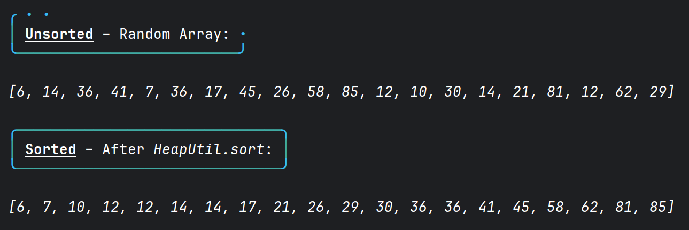

## Heapsort / Heap Utilities
> ***Algorithm Design & Analysis*** @ SCSU, *Spring '26*

| Package                                                                           | Description                                                                                               |
|:----------------------------------------------------------------------------------|:----------------------------------------------------------------------------------------------------------|
| [*assignment.heaps*](https://github.com/anastaci1a/algo26-pa-01/assignment/heaps) | Heap utils and sorting functionality                                                                      |
| [*assignment.ana*](https://github.com/anastaci1a/algo26-pa-01/assignment/ana)     | Extra testing utils, copied from ***[ana.\*](https://anastaci1a.github.io/ana-dot-star/)*** (proprietary) |

---

> ### [HeapUtil.java](https://github.com/anastaci1a/algo26-pa-01/assignment/heaps/HeapUtil.java)
> > *src/assignment/heaps/* **HeapUtil.java**
> 
> | Public Method                                                    | Description                                                                                                                                                                                   |
> |:-----------------------------------------------------------------|:----------------------------------------------------------------------------------------------------------------------------------------------------------------------------------------------|
> | <code>static void sort(int[] arr)</code>                         | Sort the entire input array <code>arr</code>.                                                                                                                                                 |
> | <code>static void sort(int[] arr, int size)</code>               | Sort a subset of the array <code>arr</code>, by amount <code>size</code>.                                                                                                                     |
> | <code>static void maxHeapify(int[] arr, int size)</code>         | Reorder a subset of the array <code>arr</code> into a max heap, by amount <code>size</code>.                                                                                                  |
> | <code>static void siftDown(int[] arr, int start, int end)</code> | Reorder a subset of the array <code>arr</code> into a max heap, by amount <code>size</code>. Requires that the left and right children of the node at index <code>start</code> are max heaps. |

---

> ### [HeapTester.java](https://github.com/anastaci1a/algo26-pa-01/test/HeapTester.java) – Example Output
> > *test/* **HeapUtil.java**
>
> 